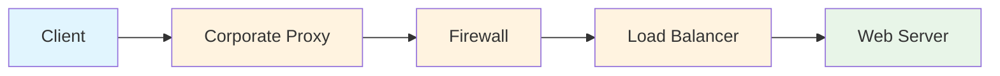
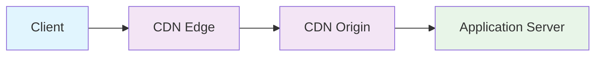

# End to End vs Hop by Hop 通信の詳細解説

## 🔄 基本概念

### **End to End（エンドツーエンド）通信**
通信の**両端点（クライアントとサーバー）間で直接関係する**処理や情報のこと。中継点（プロキシ、ルーター等）は内容を解釈・変更せずに転送する。

### **Hop by Hop（ホップバイホップ）通信**
通信経路上の**各区間（ホップ）ごとに個別に処理される**もの。各中継点で内容を解釈・変更・終端する可能性がある。

## 📊 視覚的な理解

```
End to End:
[Client] =====================================》 [Server]
         ↑               ↑               ↑
         |               |               |
    暗号化データ      中継は透過        復号化データ
    
Hop by Hop:
[Client] -----> [Proxy] -----> [LB] -----> [Server]
    ↑       ↑       ↑       ↑       ↑       ↑
    |       |       |       |       |       |
  HTTP/1.1 処理   HTTP/2  処理   HTTP/1.1  処理
         変換           変換
```

## 🌐 HTTPにおけるEnd to End vs Hop by Hop

### **End to End ヘッダー**
```http
Accept: application/json              # サーバーが解釈
Authorization: Bearer token123        # サーバーが認証に使用
Content-Type: application/json        # サーバーがデータ形式を理解
User-Agent: Mozilla/5.0...           # サーバーがクライアント識別
```

### **Hop by Hop ヘッダー**
```http
Connection: keep-alive               # 各接続区間で処理
Transfer-Encoding: chunked          # 各区間で転送方式を制御
Upgrade: websocket                  # 直接の接続相手とプロトコル交渉
Proxy-Authorization: Basic xyz      # プロキシで認証処理
```

## 🔐 wss の実装と証明書

### **wss は HTTPS と同じ証明書を使用**
```typescript
// Node.js でのwssサーバー実装
import https from 'https';
import fs from 'fs';
import { WebSocketServer } from 'ws';

// HTTPS と同じ証明書を使用
const serverOptions = {
  cert: fs.readFileSync('/path/to/cert.pem'),
  key: fs.readFileSync('/path/to/private-key.pem')
};

// HTTPSサーバーを作成
const httpsServer = https.createServer(serverOptions);

// WebSocketServerをHTTPSサーバーにアタッチ
const wss = new WebSocketServer({ 
  server: httpsServer,
  path: '/websocket'
});

httpsServer.listen(443, () => {
  console.log('wss://server.example.com:443/websocket で待機中');
});
```

### **証明書の種類と取得方法**
```bash
# Let's Encrypt（無料）での証明書取得例
certbot certonly --standalone -d server.example.com

# 取得されるファイル
/etc/letsencrypt/live/server.example.com/
├── cert.pem        # サーバー証明書
├── chain.pem       # 中間証明書
├── fullchain.pem   # 証明書チェーン全体
└── privkey.pem     # 秘密鍵
```

## 🔍 Hop by Hop での暗号化の実際

### **完全には見えないが、一部情報は露出**

#### **プロキシ・LBが見えるもの**
```
1. 接続先情報:
   - ホスト名: server.example.com (SNI※で露出)
   - ポート: 443
   - IPアドレス

2. 通信パターン:
   - 接続時刻、通信量、接続時間
   - WebSocketかHTTPSかの区別（難しい）

3. 証明書情報:
   - サーバー証明書の内容（公開情報）
```

#### **プロキシ・LBが見えないもの**
```
1. 通信内容:
   - WebSocketハンドシェイクの詳細
   - WebSocketフレームの内容
   - 認証情報、メッセージデータ

2. アプリケーション情報:
   - URLパス（/chat など）
   - WebSocketサブプロトコル
   - カスタムヘッダー
```

### **実際の通信フロー**

#### **HTTP CONNECT でのトンネル確立**
```http
# 1. クライアント → プロキシ
CONNECT server.example.com:443 HTTP/1.1
Host: server.example.com:443
Proxy-Authorization: Basic cHJveHk6cGFzcw==

# 2. プロキシ → クライアント
HTTP/1.1 200 Connection established

# 3. この時点でトンネル確立、以下は暗号化される
```

#### **暗号化されたWebSocketハンドシェイク**
```typescript
// プロキシには以下が暗号化されて見える
const encryptedData = `
  [暗号化されたバイナリデータ]
  実際の内容：
  GET /chat HTTP/1.1
  Host: server.example.com
  Upgrade: websocket
  Connection: Upgrade
  Sec-WebSocket-Key: dGhlIHNhbXBsZQ==
  Authorization: Bearer secret123  // ← 安全！
`;
```

## 🏢 企業環境での実装例

### **プロキシ環境対応の wss クライアント**
```typescript
class EnterpriseWebSocket {
  private proxyHost = 'proxy.company.com';
  private proxyPort = 8080;
  private proxyAuth = 'Basic ' + btoa('user:password');
  
  async connectThroughProxy(wsUrl: string): Promise<WebSocket> {
    const url = new URL(wsUrl);
    
    if (this.isProxyEnvironment()) {
      // 1. HTTP CONNECTでトンネル確立
      await this.establishSecureTunnel(url.host);
    }
    
    // 2. wss接続（プロキシには暗号化データのみ見える）
    return new WebSocket(wsUrl);
  }
  
  private async establishSecureTunnel(targetHost: string): Promise<void> {
    const connectRequest = new Request(`http://${this.proxyHost}:${this.proxyPort}`, {
      method: 'CONNECT',
      headers: {
        'Host': targetHost,
        'Proxy-Authorization': this.proxyAuth,
        'Proxy-Connection': 'Keep-Alive'
      }
    });
    
    // プロキシはここでトンネルを提供するのみ
    // WebSocketの内容は見えない
  }
}
```

### **ロードバランサー環境での考慮事項**
```typescript
// ロードバランサー（L4/L7）での違い
class LoadBalancerAwareWebSocket {
  connectWithStickySession(wsUrl: string): WebSocket {
    // wssの場合、ロードバランサーの動作が変わる
    
    if (this.isL4LoadBalancer()) {
      // L4（Transport Layer）: IPとポートのみ見える
      // WebSocketの内容は完全に暗号化
      console.log('L4 LB: WebSocket内容は完全に見えない');
      
    } else if (this.isL7LoadBalancer()) {
      // L7（Application Layer）: SSL terminationの場合
      // LBで一度復号化され、再暗号化される
      console.log('L7 LB: SSL termination環境では内容が見える');
    }
    
    return new WebSocket(wsUrl);
  }
}
```

## ⚠️ セキュリティ上の注意点

### **SNI（Server Name Indication）による情報露出**
```typescript
// SNIでホスト名が暗号化前に露出
const ws = new WebSocket('wss://secret-service.company.com/api');
//                        ^^^^^^^^^^^^^^^^^^^^^^^^^^
//                        この部分がSNIで平文送信される

// 対策：IPアドレス直接指定（ただし証明書検証が複雑に）
const ws = new WebSocket('wss://192.168.1.100/api', {
  headers: {
    'Host': 'secret-service.company.com'
  }
});
```

### **SSL Termination 環境での注意**
```typescript
// SSL Terminationを行うロードバランサー環境
class SSLTerminationAwareWebSocket {
  connect(wsUrl: string): WebSocket {
    // 注意：ロードバランサーで一度復号化される環境では
    // ロードバランサー上でWebSocketの内容が見える
    
    console.warn(`
      SSL Termination環境では：
      Client --[暗号化]--> LB --[平文]--> Server
                            ↑
                      ここで内容が見える
    `);
    
    return new WebSocket(wsUrl);
  }
}
```

## 🔧 実装上のベストプラクティス

### **証明書の自動更新**
```typescript
// Let's Encryptでの自動更新対応
class AutoRenewWebSocketServer {
  private wss: WebSocketServer;
  private httpsServer: https.Server;
  
  constructor() {
    this.setupCertificateWatcher();
  }
  
  private setupCertificateWatcher(): void {
    // 証明書ファイルの変更監視
    fs.watchFile('/etc/letsencrypt/live/server.example.com/fullchain.pem', () => {
      console.log('証明書が更新されました。サーバーを再起動します。');
      this.reloadCertificates();
    });
  }
  
  private reloadCertificates(): void {
    // ゼロダウンタイムでの証明書更新
    const newOptions = {
      cert: fs.readFileSync('/etc/letsencrypt/live/server.example.com/fullchain.pem'),
      key: fs.readFileSync('/etc/letsencrypt/live/server.example.com/privkey.pem')
    };
    
    // 新しい証明書でサーバー再起動
    this.gracefulRestart(newOptions);
  }
}
```

### **開発・本番環境の切り替え**
```typescript
// 環境別の接続設定
class EnvironmentAwareWebSocket {
  createConnection(): WebSocket {
    const isDevelopment = process.env.NODE_ENV === 'development';
    const isLocalhost = window.location.hostname === 'localhost';
    
    if (isDevelopment && isLocalhost) {
      // 開発環境：非暗号化（デバッグ容易）
      console.warn('開発環境：非暗号化WebSocket使用');
      return new WebSocket('ws://localhost:8080/websocket');
      
    } else {
      // 本番環境：暗号化必須
      return new WebSocket('wss://api.example.com/websocket');
    }
  }
}
```

## 📋 まとめ：wss での Hop by Hop 暗号化

| 項目 | プロキシ・LBで見える | プロキシ・LBで見えない |
|------|---------------------|----------------------|
| **接続情報** | ホスト名（SNI）、ポート | URLパス、クエリパラメータ |
| **通信量** | データサイズ、タイミング | 具体的な内容 |
| **証明書** | 公開鍵、発行者情報 | 秘密鍵 |  
| **WebSocket** | 通信パターン | ハンドシェイク詳細、メッセージ |
| **認証** | - | Authorization ヘッダー |

**結論**：
1. **wss は HTTPS と同じ証明書**を使用
2. **Hop by Hop で暗号化**されるが、接続先情報（SNI）は露出
3. **SSL Termination 環境**では中間点で復号化される場合あり
4. **本番環境では wss 必須**、セキュリティと利便性のバランスが重要

### **ws（非暗号化WebSocket）の場合**

#### **End to End が弱化**
```typescript
// ws:// - 非暗号化通信
const ws = new WebSocket('ws://server.example.com/chat');

ws.send(JSON.stringify({
  type: 'sensitive_data',
  content: 'クレジットカード番号: 1234-5678-9012-3456' // ← 危険！
}));
```

**問題点：**
- **中継点で内容が丸見え**: プロキシ、ファイアウォール、ISPで内容を読み取り可能
- **改ざんリスク**: 中継点でメッセージ内容を変更される可能性
- **盗聴リスク**: ネットワーク上で通信内容を傍受される

#### **実際の通信経路での問題**
```
[Client] ---平文データ---> [Corporate Proxy] ---平文データ---> [Server]
                              ↑
                        ここで内容が見える・変更可能
```

### **wss（暗号化WebSocket）の場合**

#### **End to End が強化**
```typescript
// wss:// - TLS暗号化通信
const ws = new WebSocket('wss://server.example.com/chat');

ws.send(JSON.stringify({
  type: 'sensitive_data',
  content: 'クレジットカード番号: 1234-5678-9012-3456' // ← 安全
}));
```

**保護効果：**
- **中継点では暗号化データのみ**: 内容を読み取れない
- **改ざん検知**: TLSで通信の整合性を保証
- **認証**: サーバー証明書で接続先を確認

#### **実際の通信経路での保護**
```
[Client] ---暗号化データ---> [Corporate Proxy] ---暗号化データ---> [Server]
                                ↑
                          暗号化されているため内容不明
```

## 🏢 プロキシ環境での大きな違い

### **ws の場合：プロキシでの処理**
```typescript
// プロキシがWebSocketの内容を検査・変更可能
class InsecureProxyWebSocket {
  connect(url: string): void {
    // HTTP Upgradeリクエスト（平文）
    // プロキシがWebSocketフレームの内容を読み取り・変更可能
    this.ws = new WebSocket('ws://internal-server/chat');
    
    this.ws.onmessage = (event) => {
      // プロキシで変更された可能性のあるデータ
      console.log('受信（改ざんリスク）:', event.data);
    };
  }
}
```

### **wss の場合：HTTP CONNECTによるトンネル**
```typescript
// プロキシではHTTP CONNECTでトンネルを確立
class SecureProxyWebSocket {
  async connect(url: string): Promise<void> {
    // 1. HTTP CONNECTでプロキシにトンネル要求
    const tunnelResponse = await fetch('CONNECT server.example.com:443', {
      method: 'CONNECT',
      headers: {
        'Proxy-Authorization': 'Basic ' + btoa('user:pass')
      }
    });
    
    if (tunnelResponse.status === 200) {
      // 2. トンネル確立後、暗号化WebSocket接続
      this.ws = new WebSocket('wss://server.example.com/chat');
      
      this.ws.onmessage = (event) => {
        // プロキシには暗号化データのみ送信される
        console.log('受信（安全）:', event.data);
      };
    }
  }
}
```

## 🔍 ハンドシェイクでの違い

### **ws ハンドシェイク（危険）**
```http
GET /chat HTTP/1.1
Host: server.example.com
Upgrade: websocket                    # ← Hop by Hop（平文で見える）
Connection: Upgrade                   # ← Hop by Hop（平文で見える）
Sec-WebSocket-Key: dGhlIHNhbXBsZQ==  # ← End to End（しかし平文）
Sec-WebSocket-Version: 13             # ← End to End（しかし平文）
Authorization: Bearer secret-token    # ← 危険！認証情報が平文
```

**問題：**
- 認証情報がプロキシに丸見え
- WebSocketキーが傍受される可能性

### **wss ハンドシェイク（安全）**
```http
# まずHTTP CONNECTでトンネル確立
CONNECT server.example.com:443 HTTP/1.1
Host: server.example.com:443
Proxy-Authorization: Basic proxyauth  # ← プロキシ認証のみ平文

# トンネル確立後、暗号化された中で以下を送信
GET /chat HTTP/1.1
Host: server.example.com
Upgrade: websocket                    # ← 暗号化されている
Connection: Upgrade                   # ← 暗号化されている  
Sec-WebSocket-Key: dGhlIHNhbXBsZQ==  # ← 暗号化されている
Authorization: Bearer secret-token    # ← 安全！暗号化されている
```

## ⚠️ 実装時の注意点

### **ws を使う場合の対策**
```typescript
// ws使用時は追加の暗号化を実装
class DoubleEncryptedWebSocket {
  private applicationKey: CryptoKey;
  
  async sendSecureMessage(data: any): Promise<void> {
    // ws://でも内容を保護するため、アプリケーションレベルで暗号化
    const jsonData = JSON.stringify(data);
    const encryptedData = await this.encryptAtAppLevel(jsonData);
    
    // wsで送信するが、内容は暗号化済み
    this.ws.send(encryptedData);
  }
  
  private async encryptAtAppLevel(data: string): Promise<string> {
    const encoder = new TextEncoder();
    const dataBuffer = encoder.encode(data);
    
    const encrypted = await crypto.subtle.encrypt(
      { name: 'AES-GCM', iv: crypto.getRandomValues(new Uint8Array(12)) },
      this.applicationKey,
      dataBuffer
    );
    
    return btoa(String.fromCharCode(...new Uint8Array(encrypted)));
  }
}
```

### **wss 使用時のベストプラクティス**
```typescript
// wss + 証明書検証
class SecureWebSocketWithValidation {
  constructor(url: string) {
    // wss://の使用を強制
    if (!url.startsWith('wss://')) {
      throw new Error('非暗号化接続は許可されていません');
    }
    
    this.ws = new WebSocket(url);
    
    // 接続エラー時の適切な処理
    this.ws.onerror = (error) => {
      console.error('暗号化接続エラー（証明書問題の可能性）:', error);
    };
  }
}
```

## 📊 セキュリティ比較表

| 項目 | ws（非暗号化） | wss（暗号化） |
|------|----------------|---------------|
| **ハンドシェイク** | 平文（危険） | 暗号化（安全） |
| **メッセージデータ** | 平文（危険） | 暗号化（安全） |
| **認証情報** | 平文（危険） | 暗号化（安全） |
| **プロキシでの可視性** | 全て見える | 暗号化データのみ |
| **改ざんリスク** | 高い | TLSで保護 |
| **盗聴リスク** | 高い | 暗号化で保護 |
| **End to End保証** | なし | あり |
| **適用場面** | 開発環境のみ | 本番環境必須 |

## 🎯 実践的な選択指針

### **ws を使うべき場合（限定的）**
- **開発環境でのみ**: デバッグ目的
- **社内ネットワーク**: 信頼できるネットワーク内
- **非機密データ**: 公開情報のみ

### **wss を使うべき場合（推奨）**
- **本番環境**: 必須
- **機密データ**: 個人情報、認証情報
- **インターネット経由**: 公開ネットワーク
- **コンプライアンス**: セキュリティ要件がある場合

**結論**: ws と wss では **End to End セキュリティが根本的に異なり**、wss では中継点での内容解読・改ざんが防げるため、本番環境では wss の使用が必須です。

### **End to End セキュリティ**
```typescript
// TLS/SSL暗号化 - エンドツーエンド
const httpsRequest = https.request({
  hostname: 'api.example.com',
  port: 443,
  path: '/data',
  method: 'GET',
  // 中継点では暗号化されたデータのみ見える
});
```

**特徴:**
- クライアント⇔サーバー間で暗号化
- 中継点は暗号化されたデータを転送するのみ
- プライバシー保護が強い

### **Hop by Hop セキュリティ**
```typescript
// プロキシ認証 - ホップバイホップ
const proxyRequest = http.request({
  host: 'proxy.company.com',
  port: 8080,
  method: 'GET',
  path: 'http://api.example.com/data',
  headers: {
    'Proxy-Authorization': 'Basic ' + Buffer.from('user:pass').toString('base64')
  }
});
```

**特徴:**
- 各区間で個別に認証・暗号化
- 中継点でデータの検査・変更が可能
- 企業ネットワーク等で利用

## 🔌 WebSocketにおけるEnd to End vs Hop by Hop

### **WebSocketハンドシェイク（Hop by Hop）**
```http
GET /chat HTTP/1.1
Host: server.example.com
Upgrade: websocket                    # ← Hop by Hop
Connection: Upgrade                   # ← Hop by Hop
Sec-WebSocket-Key: dGhlIHNhbXBsZQ==  # ← End to End
Sec-WebSocket-Version: 13             # ← End to End
```

### **WebSocket通信確立後（End to End）**
```typescript
// WebSocket通信は基本的にEnd to End
const ws = new WebSocket('wss://server.example.com/chat');

ws.onopen = () => {
  // この通信は暗号化されてエンドツーエンド
  ws.send(JSON.stringify({
    type: 'message',
    content: 'Hello World'
  }));
};
```

## 🏢 実際の環境での例

### **企業環境（複数のHop）**


**各Hopでの処理:**
- **Corporate Proxy**: 認証、フィルタリング、ログ記録
- **Firewall**: セキュリティチェック、ポート制御
- **Load Balancer**: 負荷分散、ヘルスチェック

### **クラウド環境（CDN使用）**


## 📝 実装での注意点

### **プロキシ通過時のWebSocket**
```typescript
// プロキシ環境でのWebSocket接続
class ProxyAwareWebSocket {
  constructor(url: string, protocols?: string[]) {
    // プロキシ設定の確認
    if (this.hasProxy()) {
      // HTTP CONNECTメソッドでトンネル確立
      this.establishTunnel(url).then(() => {
        this.ws = new WebSocket(url, protocols);
      });
    } else {
      this.ws = new WebSocket(url, protocols);
    }
  }
  
  private hasProxy(): boolean {
    // プロキシ環境の検出ロジック
    return window.location.hostname.includes('.corporate.com');
  }
  
  private async establishTunnel(url: string): Promise<void> {
    // HTTP CONNECT要求でプロキシトンネル確立
    // これはHop by Hopでプロキシに処理される
  }
}
```

### **End to End暗号化の実装**
```typescript
// アプリケーションレベルでのEnd to End暗号化
class SecureWebSocket {
  private encryptionKey: CryptoKey;
  
  async sendSecureMessage(data: any): Promise<void> {
    // 1. データをJSON化
    const jsonData = JSON.stringify(data);
    
    // 2. End to End暗号化（中継点では読めない）
    const encryptedData = await this.encrypt(jsonData);
    
    // 3. WebSocketで送信（TLS + アプリケーション暗号化）
    this.ws.send(encryptedData);
  }
  
  private async encrypt(data: string): Promise<ArrayBuffer> {
    const encoder = new TextEncoder();
    const dataBuffer = encoder.encode(data);
    
    return await crypto.subtle.encrypt(
      { name: 'AES-GCM', iv: crypto.getRandomValues(new Uint8Array(12)) },
      this.encryptionKey,
      dataBuffer
    );
  }
}
```

## 🎯 実際の選択基準

### **End to Endを選ぶべき場合**
- **プライバシー重視**: 金融データ、医療情報
- **セキュリティ重視**: 認証情報、個人情報
- **データ整合性**: 改ざん防止が必要
- **コンプライアンス**: 規制要件がある

### **Hop by Hopを選ぶべき場合**
- **ネットワーク最適化**: キャッシュ、圧縮
- **監査・ログ**: 企業のセキュリティポリシー
- **プロトコル変換**: HTTP/1.1 ⇔ HTTP/2変換
- **負荷分散**: 動的なルーティング

## 🔧 TypeScriptでの実装パターン

### **End to End認証**
```typescript
interface EndToEndMessage {
  type: string;
  timestamp: number;
  signature: string;  // サーバーが検証
  payload: any;
}

class AuthenticatedWebSocket {
  private privateKey: CryptoKey;
  
  async sendAuthenticatedMessage(data: any): Promise<void> {
    const message: EndToEndMessage = {
      type: 'authenticated',
      timestamp: Date.now(),
      signature: await this.sign(data),
      payload: data
    };
    
    this.ws.send(JSON.stringify(message));
  }
  
  private async sign(data: any): Promise<string> {
    // End to End署名（中継点では検証されない）
    const dataString = JSON.stringify(data);
    const signature = await crypto.subtle.sign(
      'RSASSA-PKCS1-v1_5',
      this.privateKey,
      new TextEncoder().encode(dataString)
    );
    return btoa(String.fromCharCode(...new Uint8Array(signature)));
  }
}
```

### **Hop by Hop接続管理**
```typescript
class HopByHopWebSocket {
  private reconnectAttempts = 0;
  private maxReconnectAttempts = 5;
  
  connect(url: string): void {
    this.ws = new WebSocket(url);
    
    this.ws.onopen = () => {
      console.log('Connected to immediate hop');
      this.reconnectAttempts = 0;
    };
    
    this.ws.onclose = (event) => {
      // Hop by Hopで切断された場合の処理
      if (event.code === 1006) { // プロキシ切断
        this.handleProxyDisconnection();
      }
    };
  }
  
  private handleProxyDisconnection(): void {
    // 各Hopでの切断に対する個別対応
    if (this.reconnectAttempts < this.maxReconnectAttempts) {
      setTimeout(() => {
        this.reconnectAttempts++;
        this.connect(this.currentUrl);
      }, Math.pow(2, this.reconnectAttempts) * 1000);
    }
  }
}
```

## 📋 まとめ

| 観点 | End to End | Hop by Hop |
|------|------------|------------|
| **処理場所** | 通信両端のみ | 各中継点 |
| **セキュリティ** | 高い（暗号化） | 中程度（中継点で解読可能） |
| **パフォーマンス** | シンプル | 最適化可能 |
| **デバッグ** | 困難 | 容易 |
| **用途** | 機密データ、認証 | 負荷分散、キャッシュ |
| **WebSocketでの例** | メッセージデータ | 接続管理、プロトコル交渉 |

**適切な選択**がアプリケーションのセキュリティとパフォーマンスを左右します。WebSocket開発では、**ハンドシェイクはHop by Hop、実際のデータ通信はEnd to End**という理解が重要です。