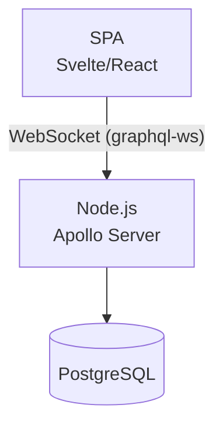
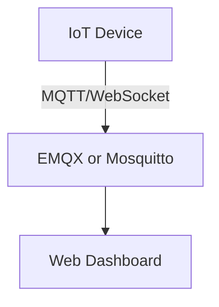
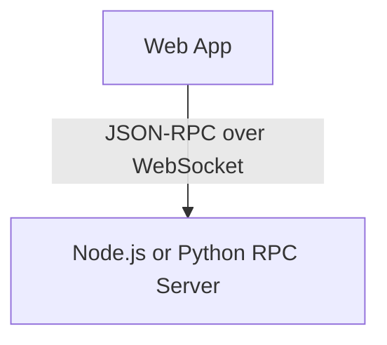
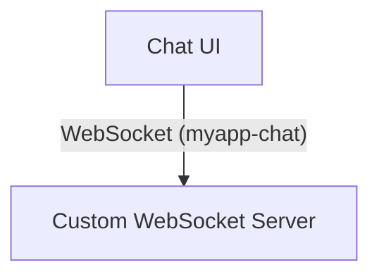
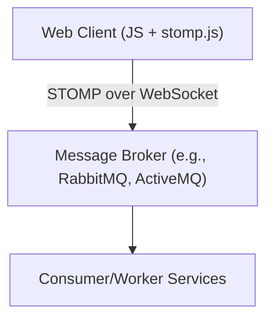

# 🌐 WebSocket サブプロトコル一覧

WebSocket のサブプロトコルは、WebSocket 上で動作する「アプリケーションレベルのプロトコル」です。ここでは代表的なプロトコルの概要と、ユースケース別の構成例を示します。

## 補足

- WebSocket は「双方向チャネル」の役割を担い、メッセージ構造そのものは `graphql-ws` などのサブプロトコルに委ねられます。
- サブプロトコルは「どう話すか（構文やモデル）」を規定するもので、アプリケーション層の中でもさらに上位にあたります。
- このように、アプリケーション層は内部において機能的な分担があると整理できます。

### 🧱 TCP/IPモデルとのレイヤー整理表

WebSocket は TCP/IP モデルにおける「アプリケーション層」に位置づけられます。その上で動作する `graphql-ws` や `mqtt` などのサブプロトコルもアプリケーション層の一部ですが、「構文・通信モデル」の観点から、さらに上位・下位で整理されることがあります。

| TCP/IP層 | 役割 | 具体例 |
|----------|------|--------|
| アプリケーション層（意味的通信） | 通信の構文・意味 | GraphQL, MQTT, JSON-RPC |
| アプリケーション層（フレーミング） | 双方向チャネルの確立・維持 | WebSocket |
| トランスポート層 | 信頼性のあるデータ転送 | TCP |
| ネットワーク層 | パケットのルーティング | IP |
| データリンク/物理層 | MACアドレス、無線・有線通信 | Ethernet, Wi-Fi |

## 📋 サブプロトコル一覧

| サブプロトコル名 | 説明 |
|------------------|------|
| `graphql-ws` | GraphQL over WebSocket。サブスクリプションの標準手段。 |
| `graphql-transport-ws` | `graphql-ws` の後継プロトコル。構造化された安全な通信方式。 |
| `mqtt` | IoT 向けの軽量 Pub/Sub 通信。WebSocket 経由で MQTT を利用可能。 |
| `wamp` | Web Application Messaging Protocol。Pub/Sub と RPC 両方をサポート。 |
| `json-rpc` | JSON-RPC over WebSocket。双方向のリモート呼び出しを可能にする。 |
| `soap` | SOAP over WebSocket。企業向けレガシー連携用。 |
| `stomp` | Streaming Text Oriented Messaging Protocol。主にメッセージングミドルウェア（例：ActiveMQ, RabbitMQ）と接続するために使われる。 |
| `cbor` / `msgpack` | バイナリフォーマットによる高効率通信。独自実装に利用。 |
| `custom-protocol` | アプリ固有の独自プロトコル（例: `myapp-chat`）を定義可能。 |

## 🔮 将来が期待されるサブプロトコル候補

| サブプロトコル名 | 説明 |
|------------------|------|
| `mqtt-v5` | MQTT の拡張バージョン。より強力な制御とメタデータを提供し、今後の IoT シナリオに最適。 |
| `coap-ws` | CoAP（軽量HTTP類似プロトコル）を WebSocket 上で利用する試み。主に研究/実験段階。 |
| `graphql-transport-ws` | GraphQL over WebSocket の次世代標準候補。すでに普及しつつあり、将来の主流に。※既に存在するが「今後注目」枠で強調。 |
| `grpc-websocket` | gRPC-Web の WebSocket 対応構成。未標準だが、双方向通信用途で研究中。 |
| `wamp` | Pub/Sub + RPC 両対応のプロトコル。今後 Web アプリ間連携での採用が期待される。※既に掲載済みだが注釈で強調。 |
| `amqp-ws` | AMQP 1.0 を WebSocket 上で使う構成。Azure など一部クラウドで採用済。 |
| `xmpp-ws` | XMPP の WebSocket バインディング。チャットや通知システムとの親和性が高く、復権の兆し。 |
| `iso11073-ws` | 医療機器向けデータ交換プロトコルを WebSocket 上で扱う構成。将来的な Web 医療デバイス連携での利用が期待される。 |

## 🧭 ユースケース別アーキテクチャ構成例

### 1. GraphQL Subscriptions（`graphql-ws`）

#### ユースケース
リアルタイムでデータ更新を受信（チャット、通知、株価表示など）

#### 構成図（Mermaid）

#### 備考
- WebSocket は `Sec-WebSocket-Protocol: graphql-ws` を指定
- Apollo Server に `graphql-ws` ミドルウェアを追加

---

### 2. IoT通信（`mqtt`）

#### ユースケース
センサーの値をリアルタイムに受信／制御（スマートホーム、温度監視）

#### 構成図（Mermaid）

#### 備考
- MQTT over WebSocket はポート 8083 などを使用
- Mosquitto 設定で `listener` を追加

---

### 3. RPC風の操作（`json-rpc`）  

#### ユースケース
クライアントがバックエンドAPIを双方向に呼び出す（リモート設定操作など）

#### 構成図（Mermaid）

#### 備考
- JSON-RPC 仕様に従ったメッセージで `method`, `params`, `id` を送信
- 双方向でクライアント→サーバ、サーバ→クライアント呼び出しが可能

---

### 4. 独自プロトコル（例：`myapp-chat`）

#### ユースケース
チャットやコラボレーションアプリなど、アプリ独自の構造で通信したい場合

#### 構成図（Mermaid）

#### 備考
- 独自プロトコルを定義し、サーバで `Sec-WebSocket-Protocol` を検証
- WebSocketライブラリでハンドリングを実装（Node.jsの `ws` など）

---

### 5. メッセージングブローカー連携（`stomp`）

#### ユースケース
チャットアプリ、通知システム、バックエンド間連携など、メッセージキューを利用する構成。

#### 構成図（Mermaid）

#### 備考
- STOMP over WebSocket は `Sec-WebSocket-Protocol: stomp` を指定
- RabbitMQ などのメッセージブローカーは STOMP を WebSocket 経由で提供可能
- クライアントには `@stomp/stompjs` ライブラリを利用

## 🔮 将来が期待されるサブプロトコル候補

> 🧩 一部のプロトコルは WebTransport 上で再設計される動きが見られ、WebSocket サブプロトコルとしてではなく、将来的に WebTransport 上の標準実装として採用される可能性があります。

| サブプロトコル名 | 説明 |
|------------------|------|
| `mqtt-v5` | MQTT の拡張バージョン。より強力な制御とメタデータを提供し、今後の IoT シナリオに最適。 |
| `coap-ws` | CoAP（軽量HTTP類似プロトコル）を WebSocket 上で利用する試み。主に研究/実験段階。 |
| `graphql-transport-ws` | GraphQL over WebSocket の次世代標準候補。すでに普及しつつあり、将来の主流に。※既に存在するが「今後注目」枠で強調。 |
| `grpc-websocket` | gRPC-Web の WebSocket 対応構成。未標準だが、双方向通信用途で研究中。 |
| `wamp` | Pub/Sub + RPC 両対応のプロトコル。今後 Web アプリ間連携での採用が期待される。※既に掲載済みだが注釈で強調。 |
| `amqp-ws` | AMQP 1.0 を WebSocket 上で使う構成。Azure など一部クラウドで採用済。 |
| `xmpp-ws` | XMPP の WebSocket バインディング。チャットや通知システムとの親和性が高く、復権の兆し。 |
| `iso11073-ws` | 医療機器向けデータ交換プロトコルを WebSocket 上で扱う構成。将来的な Web 医療デバイス連携での利用が期待される。 |
| `graphql-over-webtransport` | GraphQL サブスクリプションや RPC を WebTransport の双方向ストリームで実現する構想。低レイテンシ・多重化に強み。 |
| `mqtt-over-webtransport` | IoT 向け MQTT を WebTransport 上で実装。QoS やバイナリストリーム処理がしやすくなる。 |
| `wamp-over-webtransport` | WAMP の RPC/Publish-Subscribe を WebTransport に移行し、多ストリームの効率化を図る設計。 |
| `grpc-over-webtransport` | gRPC-Web の後継構成として、バイナリ通信とリアルタイム性を強化した RPC プロトコル構成が想定される。 |
| `json-rpc-over-webtransport` | JSON-RPC をストリームごとに独立させることで、通信効率とエラーハンドリングを改善する WebTransport 版。 |
