# WebSocket の用途一覧
WebSocket の用途を「現状（2025年現在）」と「今後予想される用途」に分けて一覧形式で整理したものです。

|カテゴリ|現状の用途（実用中）|今後予想される用途（拡大/登場しつつある）|
|---|---|---|
|リアルタイム通信|チャットアプリ（Slack, Discord） ゲーム内通信（MMO等）サポートチャット|音声・映像以外の低遅延同期ドローン・ロボット制御との統合|
|共同編集|Google Docs風のリアルタイム文書編集コード共同編集（CodePen, Replit）|Figma風コラボUIの一般化教育・研修向けライブ協調ツール|
|通知・アラート|通知バッジ、在庫更新、リアルタイムアラート|セキュリティ監視・侵入検知アラートIoTデバイス状態変化の即時通知|
|データ配信|株価・為替レート・仮想通貨のリアルタイム表示ライブスポーツのスコア更新|Web上のリアルタイムダッシュボード標準化（BI/可視化統合）|
|IoT連携|スマートホームの状態更新、センサー通知WebUIからのデバイス制御|WebRTC+WebSocketでの遠隔デバイス制御スマートインフラとの融合|
|PWA統合|オフライン対応アプリとの同期補完Service Worker連携|オフライン時のキューイング+再送信の一般化低帯域下でのリアルタイムUX|
|Webベースのシミュレーション|教育用シミュレータ、Web上のマルチユーザ動作|デジタルツイン連携リアル環境とWeb同期のUX再構築|
|バックエンド連携|GraphQL SubscriptionsやRPC風通信に利用|分散型Web（DWeb）におけるピア通信|
|セキュリティ・監査|認証セッションの監視や強制ログアウト|多要素認証・リアルタイム監査連携Zero Trust系UI通知|
|金融・医療|オーダー処理・トランザクション反映（証券）患者モニタリング|リアルタイム診断表示遠隔医療の操作同期|
|VR/メタバース|アバター状態同期・ルーム移動情報送信|WebXR + WebSocketによる大規模同期空間|

## 今後の用途の方向性（まとめ）
- リアルタイムだけでなく、“信頼性ある同期” へ（ACK/再送・署名付き送信）
- IoT・エッジとの融合（WebSocketはサーバレスでも活用可能）
- WebアプリのUX向上として、PWA + WebSocket + Service Workerが主流化
- WebTransport/WebRTCとの連携で「次世代Web通信」の一翼を担う

## リアルタイム通信

リアルタイムチャットやゲーム、ライブストリーミングなどの用途に使われる。

#### 構成図
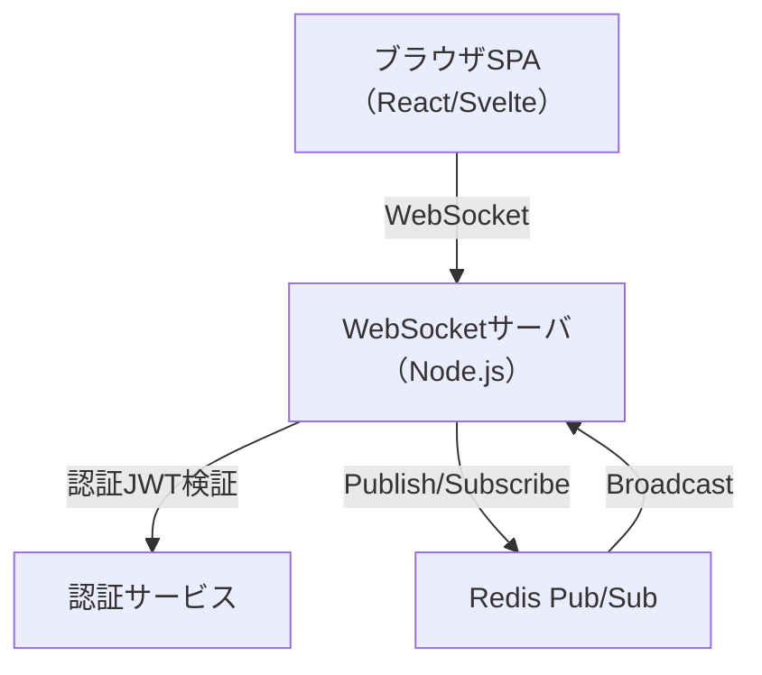

#### 構成要素の説明

- **クライアント（SPA）**: ReactやSvelteで構築されたUI。ユーザーの入力や状態変化をWebSocketで送信。
- **WebSocketサーバ**: Node.js + ws、または Fastify 等。クライアント接続を管理し、ルーム制御や中継処理を行う。
- **メッセージ中継**: Redis Pub/Sub により、複数のWebSocketサーバインスタンス間でイベントを共有。
- **認証機構**: 接続時にJWTを用いたユーザー検証を実施し、セッション情報を管理。
- **使用されるサブプロトコル例**: 独自プロトコル（JSONベース）または `socket.io`

## 共同編集

#### 構成図
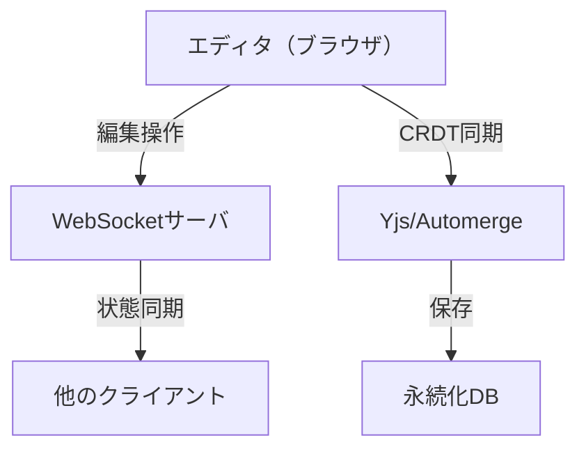

#### 構成要素の説明
- **クライアント（ブラウザエディタ）**: Markdown/WYSIWYG エディタ。操作はCRDTで管理され、状態をWebSocket経由で送信。
- **WebSocketサーバ**: 変更イベントを受信し、他クライアントへブロードキャスト。
- **同期エンジン**: YjsやAutomergeなどのCRDTライブラリを利用し、競合なしに同期。
- **永続化層**: 編集内容を定期的にデータベースへ保存。
- **使用されるサブプロトコル例**: `yjs` や `automerge` のプロトコル、独自定義プロトコル

## 通知・アラート

#### 構成図
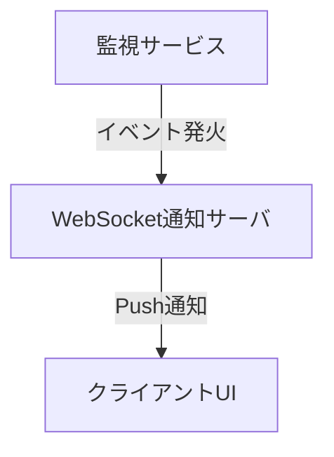

#### 構成要素の説明
- **監視サービス**: 変化検出時にイベントを発火。
- **WebSocket通知サーバ**: クライアントへ即時にイベントをプッシュ。
- **クライアント**: 通知UIやトースト表示など、ユーザーに即時反映。
- **使用されるサブプロトコル例**: 独自JSONプロトコル、または `stomp`（通知キューがある場合）

## データ配信

#### 構成図
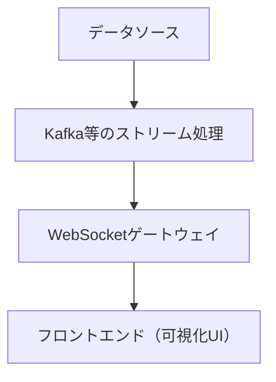

#### 構成要素の説明
- **データソース**: センサーや金融市場などの変動データ。
- **ストリーム処理**: Kafkaなどのキューで並列処理。
- **WebSocketゲートウェイ**: クライアントと接続し、データを中継。
- **クライアント**: チャートや表でデータを可視化。
- **使用されるサブプロトコル例**: 独自バイナリ/JSONプロトコル、`json-rpc` など

## IoT連携

#### 構成図
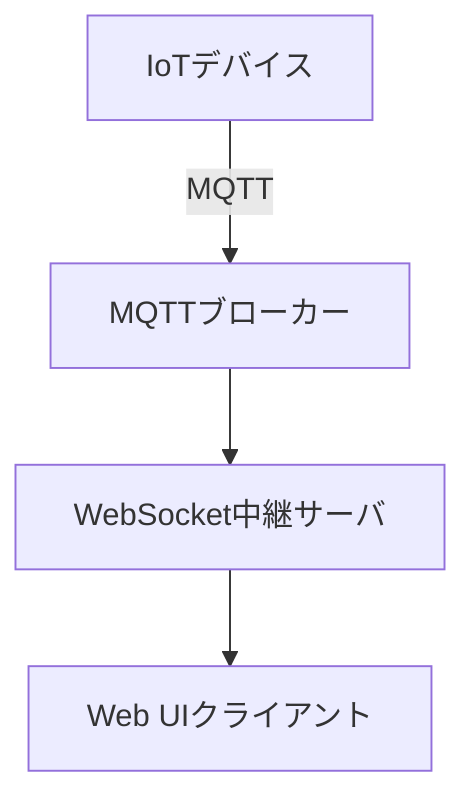

#### 構成要素の説明
- **IoTデバイス**: センサー情報や制御命令を送受信。
- **MQTTブローカー**: 軽量通信を中継。
- **中継サーバ**: MQTTとWebSocketの変換処理を行う。
- **クライアント**: 状態表示や遠隔操作を提供。
- **使用されるサブプロトコル例**: `mqtt` over WebSocket または独自バイナリプロトコル

## PWA統合

#### 構成図
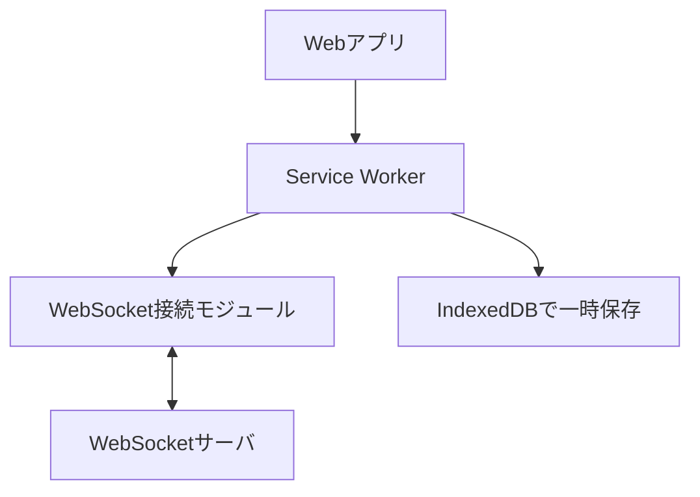

#### 構成要素の説明
- **Service Worker**: 接続断や再送、通知の制御を行う。
- **WebSocket接続モジュール**: バックエンドと双方向通信を維持。
- **IndexedDB**: 一時保存やローカルキューの保持に使用。
- **使用されるサブプロトコル例**: 独自アプリケーションプロトコル（JSON + キュー制御付き）

## Webベースのシミュレーション

#### 構成図
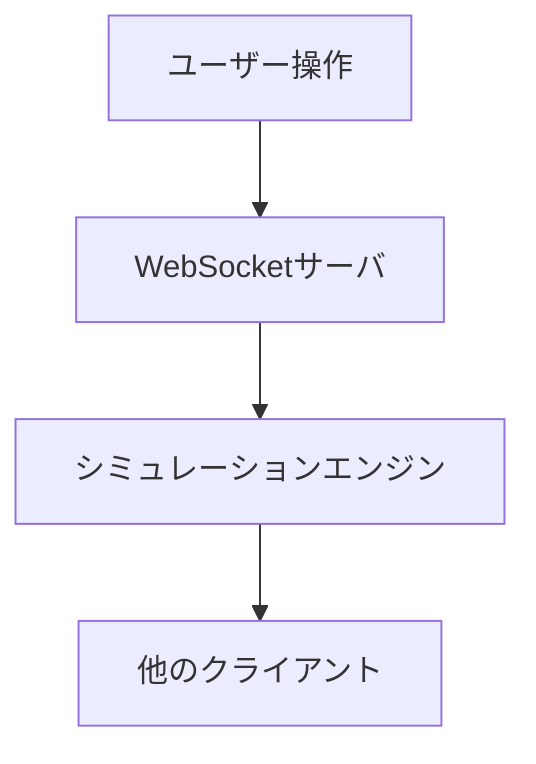

#### 構成要素の説明
- **ユーザー操作**: ブラウザ内でのアクションを送信。
- **中央シミュレーションサーバ**: 状態計算と一元管理。
- **他クライアント**: 状態をリアルタイムに受信。
- **使用されるサブプロトコル例**: 独自リアルタイム同期プロトコル（位置/状態配信）

## バックエンド連携

#### 構成図
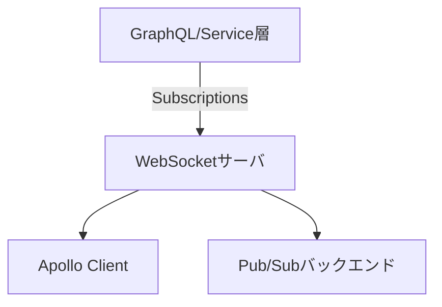

#### 構成要素の説明
- **WebSocketサーバ**: GraphQL Subscriptions や RPC 呼び出しを処理。
- **Apollo/Client等**: クライアントで受信し、UIへ反映。
- **Pub/Sub基盤**: マイクロサービス間でのデータ伝達。
- **使用されるサブプロトコル例**: `graphql-ws`, `json-rpc`, `socket.io`

## セキュリティ・監査

#### 構成図
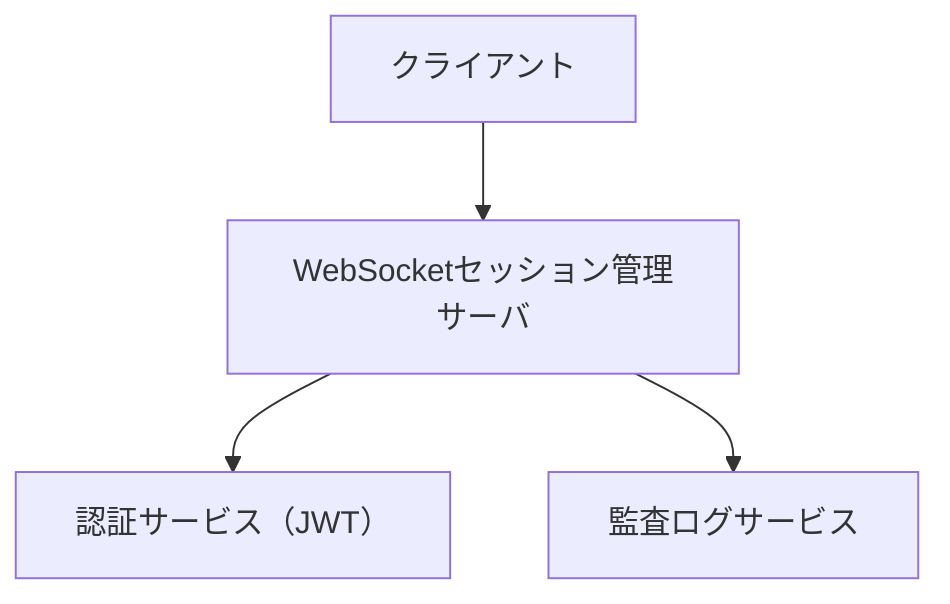

#### 構成要素の説明
- **認証サーバ**: JWT等のトークンを検証。
- **監査ログサービス**: 通信や認証の記録を蓄積。
- **クライアント**: セッション状態や警告通知を表示。
- **使用されるサブプロトコル例**: 独自セキュリティ強化プロトコル、または `json-rpc` with auth header

## 金融・医療

#### 構成図
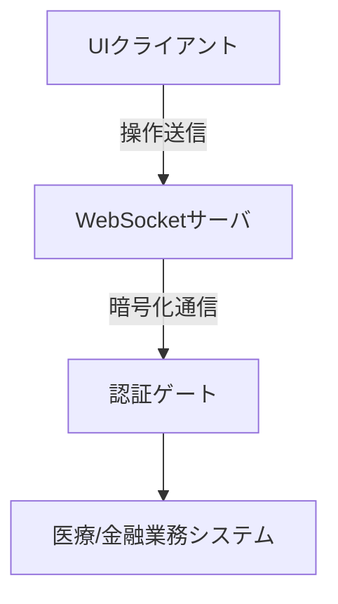

#### 構成要素の説明
- **クライアントUI**: 医療操作パネル、取引画面など。
- **WebSocket APIサーバ**: 操作受付と状態送信を統括。
- **セキュリティ層**: TLS＋アプリケーションレベルの署名認証。
- **業務システム連携**: HL7/FHIRなどの外部システムと統合。
- **使用されるサブプロトコル例**: 独自署名付きプロトコル、または `json-rpc` with TLS層対応

## VR/メタバース

#### 構成図
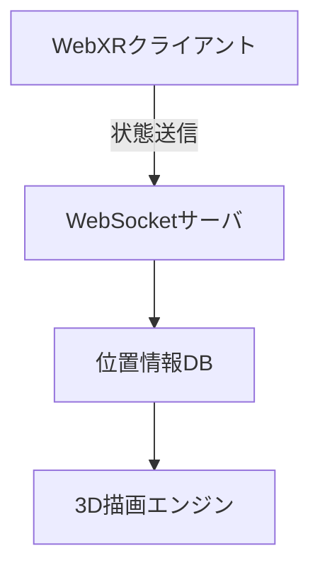

#### 構成要素の説明
- **WebXRクライアント**: VR環境での位置・動作の送受信。
- **位置情報サーバ**: アバターやオブジェクトの同期処理。
- **描画エンジン**: Three.js や Babylon.js で描画。
- **使用されるサブプロトコル例**: 独自空間同期プロトコル、`socket.io` や `protobuf` ベース
