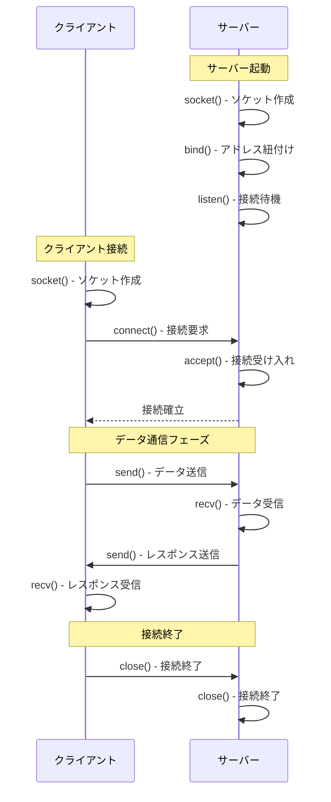

# Socket（ソケット）通信の詳細解説

## Socketとは何か？

**Socket（ソケット）**は、ネットワーク通信を行うプログラム間でデータの送受信を可能にする**通信エンドポイント**です。言い換えると、「ネットワーク越しに他のプログラムと話すための窓口」と考えることができます。

### 基本概念
- **エンドポイント**: IPアドレス + ポート番号の組み合わせ
- **双方向通信**: データの送信と受信が可能
- **抽象化レイヤー**: 複雑なネットワークプロトコルを簡単なAPI呼び出しで利用可能

Socketは低レベル通信を可能にする柔軟な仕組みであり、システムレベルのアプリケーションや通信制御が必要な場面で多用されます。特に、マルチスレッド/マルチプロセスでの接続管理やイベント駆動型アーキテクチャとの相性も良く、さまざまな分野で利用されています。

## OSI参照モデルにおけるSocketの位置

| 層 | 名称 | 説明・技術 | Socket関連 |
|---|------|------------|------------|
| **7** | **アプリケーション層** | HTTP, SMTP, FTP, DNS | アプリケーションがSocketを利用 |
| **6** | **プレゼンテーション層** | SSL/TLS, 暗号化, データ変換 | - |
| **5** | **セッション層** | セッション管理, 接続確立・切断 | **🟢 WebSocket** |
| **4** | **トランスポート層** | TCP, UDP, ポート番号 | **🔴 Socket API** |
| **3** | **ネットワーク層** | IP, ルーティング, IPアドレス | - |
| **2** | **データリンク層** | Ethernet, MAC, スイッチ | - |
| **1** | **物理層** | ケーブル, 電気信号, ハブ | - |

### 重要なポイント
- **Socket API**は主に**トランスポート層（第4層）**に位置
- TCP/UDPプロトコルを使った通信の抽象化
- **WebSocket**は**セッション層（第5層）**に位置し、HTTPを経由してSocket通信に昇格

## Socket通信の種類

Socket通信には主に**TCP Socket**と**UDP Socket**の2つの種類があります。これらはトランスポート層で使用されるプロトコルの違いにより、通信の特性が大きく異なります。

### TCP Socket vs UDP Socket

TCPとUDPは、それぞれ異なる設計思想に基づいて作られたプロトコルです：

- **TCP（Transmission Control Protocol）**: 信頼性を最重視した接続指向プロトコル
- **UDP（User Datagram Protocol）**: 速度とシンプルさを重視したコネクションレスプロトコル

| 特性 | TCP Socket | UDP Socket |
|------|------------|------------|
| **接続方式** | 接続指向（3-way handshake） | コネクションレス |
| **信頼性** | 高い（再送、順序保証） | 低い（ベストエフォート） |
| **速度** | 比較的遅い（オーバーヘッドあり） | 高速（オーバーヘッド少ない） |
| **データ配送保証** | 保証あり（パケット順序・到達保証） | 保証なし（紛失・重複の可能性） |
| **接続状態** | ステートフル（接続状態を管理） | ステートレス（接続状態なし） |
| **ヘッダサイズ** | 20バイト以上 | 8バイト固定 |
| **フロー制御** | あり（送信速度調整） | なし |
| **エラー検出・修正** | あり（自動再送） | 基本的なチェックサムのみ |
| **用途例** | Webサーバー、メール、ファイル転送、SSH | ゲーム、動画配信、DNS、IoTセンサー |
| **適用場面** | 信頼性が重要な通信 | リアルタイム性が重要な通信 |

### 使い分けの指針

**TCP Socketを選ぶべき場面**：
- データの完全性が重要（ファイル転送、Webページ、メール）
- 順序が重要な処理（チャットメッセージ、データベース同期）
- 多少の遅延は許容できるが、データ損失は許容できない場合

**UDP Socketを選ぶべき場面**：
- リアルタイム性が最重要（オンラインゲーム、ライブ配信）
- 少量のデータを高頻度で送信（IoTセンサーデータ、DNS問い合わせ）
- データが多少失われても問題ない、または独自に再送制御を実装する場合

実際の開発では、アプリケーションの要件に応じてプロトコルを選択することが重要です。例えば、リアルタイムゲームではプレイヤーの位置情報にUDPを使い、チャットメッセージにはTCPを使うといったハイブリッド構成も一般的です。


## Socket通信のフロー（TCP）



### 各フェーズの詳細

#### サーバー側の処理
1. **socket()**: ソケットファイルディスクリプタを作成
2. **bind()**: ソケットをIPアドレス:ポート番号に紐付け
3. **listen()**: 接続要求の待機状態に移行
4. **accept()**: クライアントからの接続を受け入れ

#### クライアント側の処理
1. **socket()**: ソケットファイルディスクリプタを作成
2. **connect()**: サーバーに接続要求を送信

## 実際のコード例（Node.js/TypeScript）

### サーバー側（TCP Socket）
```typescript
import * as net from 'net';

const server = net.createServer((socket) => {
  console.log('クライアント接続:', socket.remoteAddress);
  
  // データ受信イベント
  socket.on('data', (data) => {
    console.log('受信:', data.toString());
    socket.write('Echo: ' + data.toString());
  });
  
  // 接続終了イベント
  socket.on('end', () => {
    console.log('クライアント切断');
  });
});

server.listen(8080, () => {
  console.log('サーバー起動: localhost:8080');
});
```

### クライアント側（TCP Socket）
```typescript
import * as net from 'net';

const client = new net.Socket();

// サーバーに接続
client.connect(8080, 'localhost', () => {
  console.log('サーバーに接続しました');
  client.write('Hello from client!');
});

// データ受信
client.on('data', (data) => {
  console.log('受信:', data.toString());
  client.destroy(); // 接続終了
});

// 接続終了
client.on('close', () => {
  console.log('接続が閉じられました');
});
```

## SocketとWebSocketの比較

### WebSocketとは？
- WebSocket は、**セッション層（第5層）**に属するプロトコルで、
- HTTPハンドシェイクを使って、Socket（TCP）通信に昇格する手段です。

### SocketとWebSocketの比較表
| 項目 | Socket | WebSocket |
|------|--------|-----------|
| **OSI層** | 主にトランスポート層（第4層） | セッション層（第5層） |
| **ベースプロトコル** | TCP/UDP直接利用 | HTTP Upgrade経由でTCP利用 |
| **初期接続** | 直接TCP/UDP接続 | HTTP Upgradeハンドシェイク |
| **URL形式** | IPアドレス:ポート番号 | ws://, wss:// |
| **通信方式** | 全二重通信 | 全二重通信 |
| **データ形式** | バイナリ/テキスト自由 | フレーム形式（バイナリ/テキスト） |
| **ヘッダ情報** | 自由に定義可能 | WebSocketフレームヘッダ |
| **接続確立** | connect()関数 | WebSocketコンストラクタ |
| **データ送信** | send()/write()関数 | send()メソッド |
| **データ受信** | recv()/read()関数 | onmessageイベント |
| **ブラウザ対応** | ❌ 直接利用不可 | ✅ ネイティブサポート |
| **サーバー実装** | Socket APIで実装 | WebSocketライブラリ使用 |
| **ファイアウォール** | ポート制限あり | HTTP(S)ポート利用で通りやすい |
| **プロキシ対応** | 制限あり | HTTP Upgradeで対応しやすい |
| **セキュリティ** | 独自実装が必要 | TLS/SSL（wss://）で暗号化 |
| **接続維持** | 手動でハートビート実装 | 自動的なping/pongフレーム |
| **エラーハンドリング** | 低レベルエラー処理 | 高レベルイベント処理 |
| **主な用途** | サーバー間通信、IoT、ゲームサーバー | ブラウザ-サーバー間リアルタイム通信 |
| **学習コスト** | 高い（低レベルAPI） | 中程度（高レベルAPI） |
| **開発効率** | 低い（詳細制御が必要） | 高い（簡単なAPI） |

### WebSocketの誤解と補足

WebSocketは「Socketを使っているからSocket通信」と混同されがちですが、厳密にはHTTPベースのハンドシェイクによりTCP上に確立される**独自プロトコル**であり、ブラウザ向けに最適化された仕組みです。そのため、WebSocketはSocket APIとは別物であり、OSI参照モデル上も一段階上の層に位置します。

## Socket通信の利点と制限

### 利点
- **高速**: 低レベルAPIによる高速通信
- **柔軟性**: プロトコルの自由度が高い
- **効率性**: オーバーヘッドが少ない
- **汎用性**: 様々なアプリケーションで利用可能

### 制限
- **複雑性**: エラーハンドリングや接続管理が複雑
- **ブラウザ制限**: Webブラウザから直接利用不可
- **ファイアウォール**: ポート制限に引っかかりやすい
- **学習コスト**: ネットワークプログラミングの知識が必要

## 実用的な使い分け

### Socket通信を選ぶべき場合
- サーバー間通信
- IoTデバイス通信
- ゲームサーバー（UDP）
- 高速データ転送が必要な場合
- カスタムプロトコルの実装

### WebSocket通信を選ぶべき場合
- ブラウザ-サーバー間のリアルタイム通信
- チャットアプリケーション
- ライブ配信
- オンラインゲーム（Web版）
- リアルタイムダッシュボード

また、両者を併用するアーキテクチャも存在します。たとえば、IoTバックエンドではデバイスとの通信にSocketを、ユーザーインターフェースとの通信にWebSocketを用いる構成が一般的です。技術選定においては、通信の方向性、信頼性、スピード、ファイアウォール通過性などを考慮する必要があります。

## まとめ

Socketは**ネットワーク通信の基礎**となる重要な概念です。トランスポート層での通信を抽象化し、アプリケーションが簡単にネットワーク通信を行えるようにしています。

WebSocketは、このSocket通信をWebブラウザで利用できるように、HTTPプロトコルを経由して実現した上位層のプロトコルです。

どちらも**双方向通信**という点では共通していますが、**用途や制約が大きく異なる**ため、アプリケーションの要件に応じて適切に選択することが重要です。