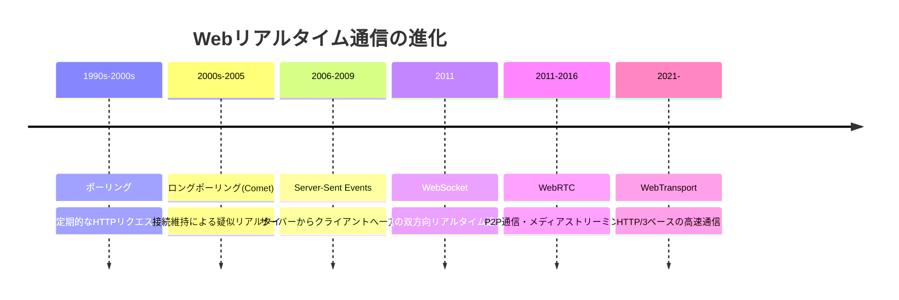
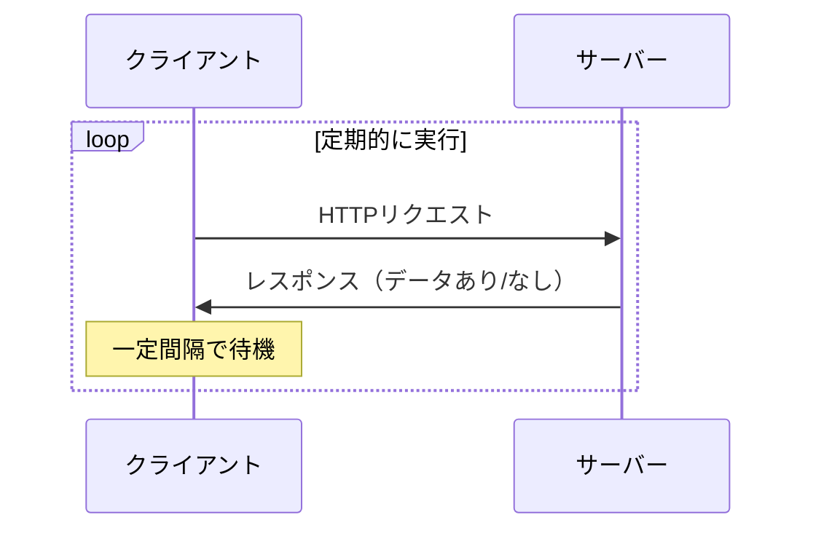
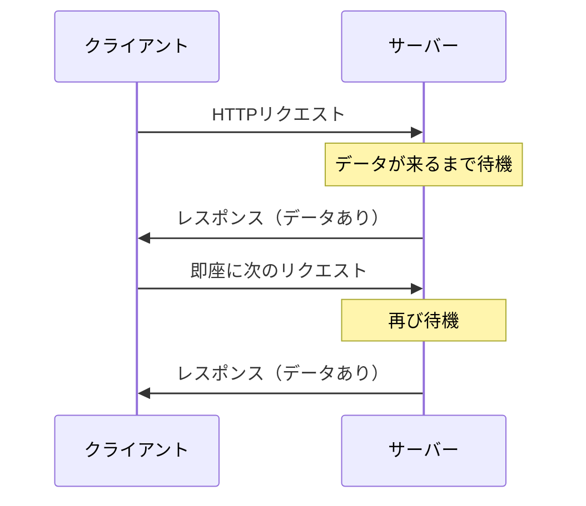
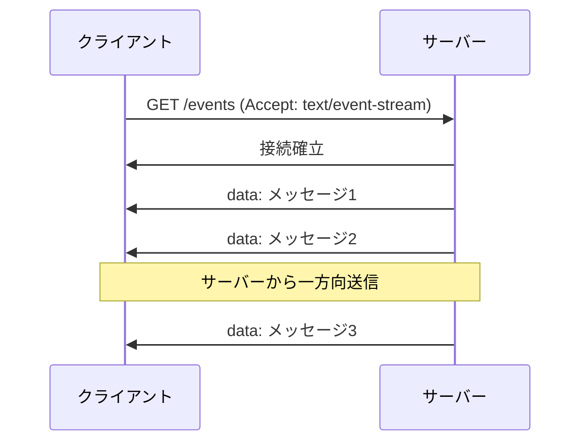
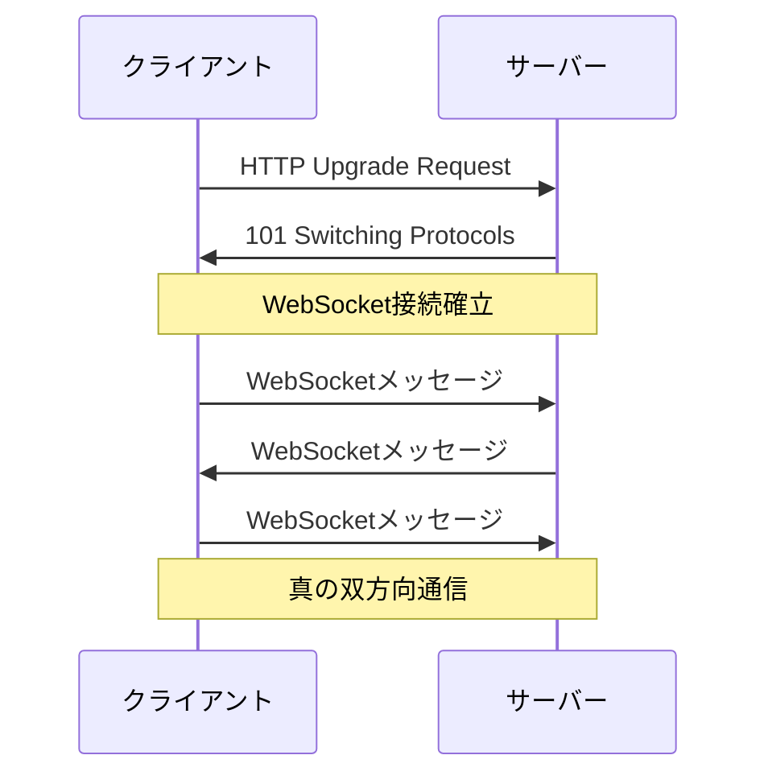
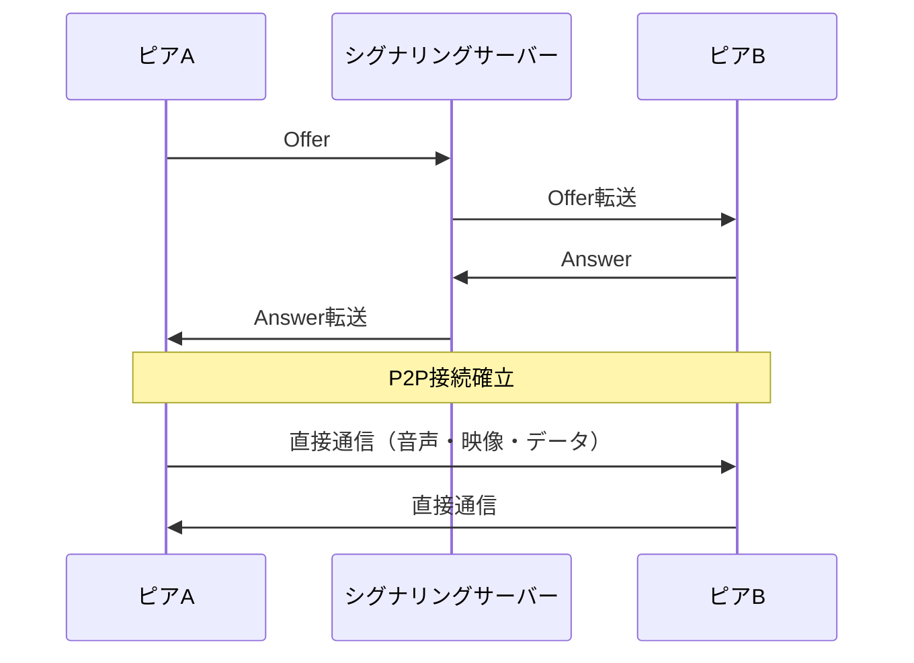
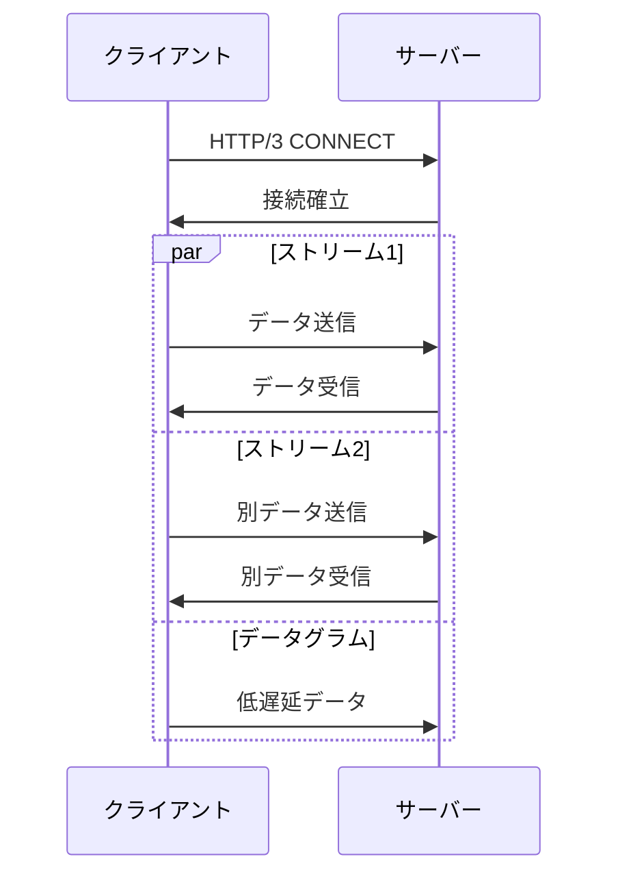
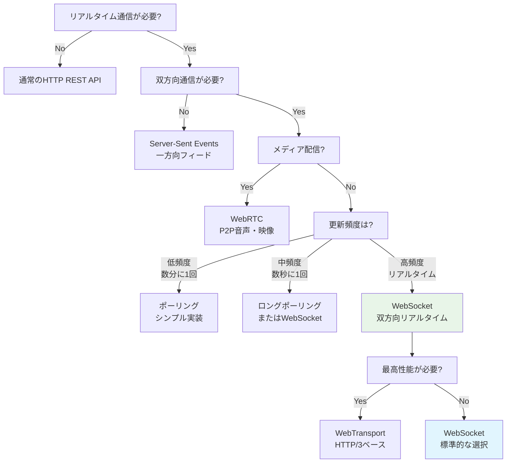

# Webリアルタイム通信技術の全体像と比較
Web通信の世界では、ポーリングやロングポーリングに始まり、WebSocket や WebRTC、そして最新の WebTransport に至るまで、多様な選択肢が存在します。これらは一見似ているようでいて、それぞれの得意分野や導入コスト、ブラウザ対応状況、通信モデルに明確な違いがあります。

この資料では、時系列に沿った進化の流れと、各技術のアーキテクチャ、メリット・デメリット、利用例を示すことで、開発者が目的に応じた適切な選択を行えるよう支援します。

## 🚀 進化の流れ



## ポーリング（Polling）



### 特徴

|特徴|メリット|デメリット|
|---|---|---|
|<ul><li>サーバからの一方向通信に利用可能</li><li>HTTP/1.1でも利用可能</li></ul>|通常のHTTPのリクエスト・レスポンス処理になるため、非常にシンプル|<ul><li>リアルタイムな通知が難しい</li><li>サーバへのリクエスト頻度が高くなる</li><li>不要なリクエストが多く発生するため、無駄にサーバのスペックを上げる必要がある</li></ul>|

### ポーリングを選ぶべき場合

- **シンプルな実装**が必要
- **更新頻度が低い**（数分に1回程度）
- **レガシーシステム**との互換性が重要

```typescript
// 例：株価情報の5分間隔更新
setInterval(async () => {
  const response = await fetch('/api/stock-prices');
  const data = await response.json();
  updateUI(data);
}, 5 * 60 * 1000);
```

## ロングポーリング（Long Polling / Comet）



### 特徴

|特徴|メリット|デメリット|
|---|---|---|
|<ul><li>疑似リアルタイム通信を実現</li><li>通常のHTTPで実装可能</li><li>イベント発生まで接続を保持</li></ul>|<ul><li>ポーリングより効率的</li><li>ファイアウォール・プロキシを通過しやすい</li><li>既存インフラで実装可能</li></ul>|<ul><li>サーバーリソースを長時間占有</li><li>接続管理が複雑</li><li>完全なリアルタイムではない</li><li>タイムアウト処理が必要</li></ul>|

### **ロングポーリングを選ぶべき場合**
- **WebSocketが使えない**環境
- **ファイアウォール**の制約がある
- **不定期なイベント**の即座な通知が必要
```typescript
// 例：通知システム
async function longPoll() {
  try {
    const response = await fetch('/api/notifications/poll', {
      timeout: 30000
    });
    const notifications = await response.json();
    processNotifications(notifications);
  } finally {
    setTimeout(longPoll, 1000); // 再接続
  }
}
```

## Server-Sent Events (SSE)



### 特徴

|特徴|メリット|デメリット|
|---|---|---|
|<ul><li>サーバーからクライアントへの一方向通信</li><li>自動再接続機能内蔵</li><li>軽量なイベントストリーム</li></ul>|<ul><li>一方向通信には最適</li><li>実装がシンプル</li><li>自動的な接続復旧</li><li>HTTP/2対応で効率的</li></ul>|<ul><li>双方向通信は不可</li><li>ブラウザ接続数制限（6接続）</li><li>Internet Explorer非対応</li><li>バイナリデータ送信が困難</li></ul>|

### **SSEを選ぶべき場合**
- **サーバーからクライアントへの一方向**通信のみ
- **ライブフィード**やイベント配信
- **WebSocketより軽量**な実装が欲しい
```typescript
// 例：ライブブログ更新
const eventSource = new EventSource('/api/live-blog');
eventSource.onmessage = (event) => {
  const update = JSON.parse(event.data);
  appendBlogPost(update);
};
```


## WebSocket



### 特徴

|特徴|メリット|デメリット|
|---|---|---|
|<ul><li>真の双方向リアルタイム通信</li><li>永続的な接続維持</li><li>低オーバーヘッド</li></ul>|<ul><li>非常に低遅延</li><li>高効率な通信</li><li>テキスト・バイナリ両対応</li><li>全ブラウザ対応</li></ul>|<ul><li>プロキシ・ファイアウォール問題</li><li>接続状態管理が複雑</li><li>ステートフルな性質</li><li>スケーリングが困難</li></ul>|

### **WebSocketを選ぶべき場合**
- **真の双方向通信**が必要
- **低遅延**が重要
- **高頻度の通信**（チャット、ゲーム、コラボ編集）
```typescript
// 例：リアルタイムチャット
const ws = new WebSocket('wss://chat.example.com');
ws.onmessage = (event) => {
  const message = JSON.parse(event.data);
  displayMessage(message);
};
ws.send(JSON.stringify({ type: 'chat', content: 'Hello!' }));
```


## WebRTC



### 特徴

|特徴|メリット|デメリット|
|---|---|---|
|<ul><li>P2P（ピアツーピア）直接通信</li><li>音声・映像・データ通信対応</li><li>シグナリングサーバー経由で接続確立</li></ul>|<ul><li>超低遅延通信</li><li>サーバー負荷が軽微</li><li>高品質メディア配信</li><li>暗号化通信標準</li></ul>|<ul><li>NAT/ファイアウォール問題</li><li>設定・実装が複雑</li><li>STUNサーバーが必要</li><li>ブラウザ間の互換性問題</li></ul>|
### **WebRTCを選ぶべき場合**
- **P2P通信**が必要
- **音声・映像**の配信
- **サーバー負荷軽減**が重要
```typescript
// 例：ビデオ通話
const peerConnection = new RTCPeerConnection();
const localStream = await navigator.mediaDevices.getUserMedia({ 
  video: true, audio: true 
});
peerConnection.addStream(localStream);
```


## WebTransport



### 特徴

|特徴|メリット|デメリット|
|---|---|---|
|<ul><li>HTTP/3（QUIC）ベース</li><li>複数ストリーム同時利用</li><li>信頼性ありとなしの選択可能</li></ul>|<ul><li>非常に高性能</li><li>柔軟な通信制御</li><li>Head-of-lineブロッキング解決</li><li>UDP風低遅延データ送信可能</li></ul>|<ul><li>新しい技術（対応ブラウザ限定）</li><li>実装・設定が複雑</li><li>デバッグが困難</li><li>学習コストが高い</li></ul>|


### **WebTransportを選ぶべき場合**
- **最高パフォーマンス**が必要
- **複数ストリーム**を同時利用
- **UDP的な低遅延通信**も必要
```typescript
// 例：高性能ゲーム通信
const transport = new WebTransport('https://game.example.com/transport');
const writer = transport.datagrams.writable.getWriter();
writer.write(new Uint8Array([1, 2, 3, 4])); // 低遅延データ
```

## 📋 技術比較表

| 技術 | 通信方向 | 接続方式 | レイテンシ | 複雑さ | サーバー負荷 | ブラウザ対応 |
|------|----------|----------|------------|--------|--------------|--------------|
| **ポーリング** | ↕️ 双方向 | 都度接続 | 高い | 低い | 高い | ✅ 全対応 |
| **ロングポーリング** | ↕️ 双方向 | 長時間接続 | 中程度 | 中程度 | 中程度 | ✅ 全対応 |
| **SSE** | ⬇️ 一方向 | 長時間接続 | 低い | 低い | 低い | ✅ 全対応 |
| **WebSocket** | ↕️ 双方向 | 永続接続 | 非常に低い | 中程度 | 低い | ✅ 全対応 |
| **WebRTC** | ↕️ P2P双方向 | P2P直接 | 最低 | 高い | 低い（シグナリングのみ） | ✅ 全対応 |
| **WebTransport** | ↕️ 双方向 | QUIC接続 | 非常に低い | 高い | 低い | 🔄 対応中 |


## 📈 技術選択フローチャート


## 🚀 WebSocketの立ち位置

### **WebSocketが優れている場面**
1. **双方向リアルタイム通信**: チャット、コラボ編集、オンラインゲーム
2. **高頻度通信**: 株価、為替、スポーツライブスコア
3. **プッシュ通知**: リアルタイムアラート、状態変更通知
4. **IoT統合**: センサーデータ、デバイス制御

### **WebSocketより良い選択肢がある場面**
1. **メディア配信** → **WebRTC**（P2P、低遅延）
2. **一方向フィード** → **SSE**（軽量、シンプル）
3. **低頻度更新** → **ポーリング**（シンプル）
4. **超高性能** → **WebTransport**（HTTP/3ベース）


## 🎯 まとめ

**WebSocket**は、**真の双方向リアルタイム通信**を実現する技術として、Web通信技術の進化における重要な位置を占めています。

- **歴史的意義**: ポーリングの無駄を解決し、真のリアルタイム通信を実現
- **現在の役割**: チャット、ゲーム、コラボツールなどの標準技術
- **将来性**: WebTransportに一部置き換わる可能性もあるが、当面は主力技術

適切な技術選択により、ユーザー体験とシステム効率の両方を最適化できます。